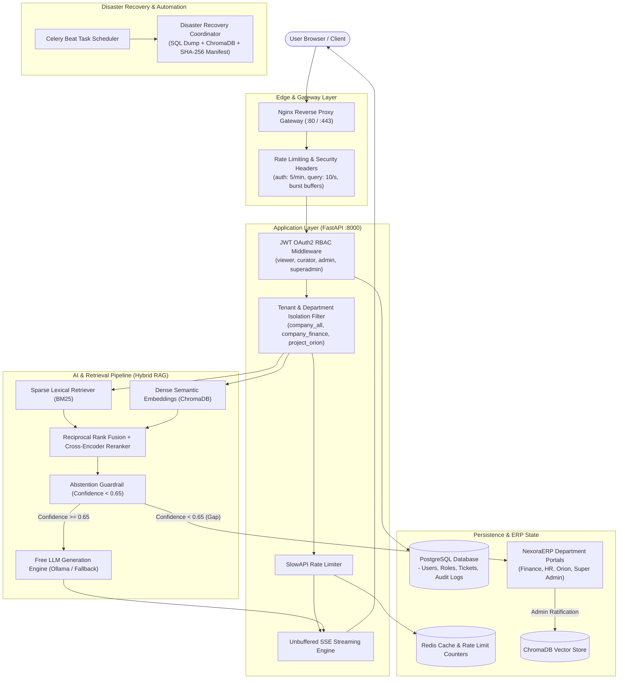

# 🎙️ NexoraERP & EKA — Production RAG Interview Demonstration Playbook

> **Target Audience**: Senior/Staff AI Engineers, System Architects, Technical Hiring Managers, and Full-Stack Engineering Leads.  
> **Key Value Proposition**: Demonstrating that Enterprise RAG is **not just a simple vector search script**, but a resilient, multi-tenant, zero-trust, continuous-learning operational platform with cryptographic disaster recovery and production edge hardening.

---

## ⏱️ The 60-Second Elevator Pitch

> *"Most naive RAG implementations fail in production for three reasons:  
> 1. **Hallucination under uncertainty**: When a company policy lacks an explicit rule, LLMs invent plausible answers that expose the business to severe legal and financial risks.  
> 2. **Security and data leakage**: They lack role-based access control at the vector layer, allowing junior employees to retrieve confidential executive payroll or technical credentials.  
> 3. **Knowledge drift**: Policies constantly change in corporate ERPs, but vector databases remain frozen snapshots.  
>  
> To solve this, I designed and built **EKA (Enterprise Knowledge Assistant)** embedded inside **NexoraERP**. It features:  
> - **Zero-Trust Multi-Tenancy**: Enforces RBAC partition boundaries at the retrieval level before similarity ranking occurs.  
> - **Explicit Abstention with Policy Guardrails**: Detects policy gaps and refrains from answering when confidence drops below 0.65, automatically generating an auditable escalation ticket in the ERP.  
> - **Autonomous Continuous Learning Loop**: When an admin ratifies the policy amendment in the ERP, the vector store hot-reloads the new chunk, enabling the assistant to answer subsequent employee queries without manual retraining.  
> - **Production Hardening**: Enforced by Nginx reverse proxy rate limiting, unbuffered SSE streaming, automated SHA-256 disaster recovery bundles, and 102 comprehensive integration tests."*

---

## 🏛️ End-to-End System Architecture



---

## 🎬 The 6-Act Live Demonstration Script

You can demonstrate this either via the **Interactive CLI Runner** or the **Full-Stack Web Interface** (or both!).

---

### ACT 1: System Health, Liveness & Prometheus Telemetry

**Goal**: Prove the system is production-monitored, observable, and enterprise-grade.

#### Terminal Demonstration
```bash
# Test health probe
curl -s http://localhost:8000/healthz
# Output: {"status":"ok"}

# Scrape live Prometheus metrics
curl -s http://localhost:8000/metrics | grep rag_http_requests_total
```

#### What to Explain to the Interviewer
- *"We expose RFC-compliant `/healthz` liveness probes and eager-loading `/readyz` readiness probes for Kubernetes/container orchestration."*
- *"Every inbound request passes through custom Prometheus middleware recording request volume, route-level latency histograms, and HTTP status codes."*

---

### ACT 2: Zero-Trust Multi-Tenancy & Access Control (RBAC)

**Goal**: Demonstrate that vector search respects enterprise organizational boundaries.

#### Web UI Walkthrough
1. Navigate to `http://localhost:5173/` and switch to **Aditya Verma (Super Administrator)**.
2. Click **Access Control Matrix** in the sidebar (`/super-admin/access-control`).
3. Point out the zero-trust scope mapping:
   - `viewer` (Employee): Only `company_all` documents.
   - `finance_admin`: `company_finance` + `company_all`.
   - `hr_admin`: `company_hr` + `company_all`.
   - `orion_lead`: `project_orion` + `company_all`.
   - `superadmin`: Global wildcard `*`.

#### What to Explain to the Interviewer
- *"A classic vulnerability in corporate RAG is semantic leakage: if an employee asks 'What are the severance terms for senior directors?', naive similarity search returns confidential board packets."*
- *"In EKA, we enforce **pre-retrieval metadata filtering**: before cosine similarity or BM25 scoring executes, we inject the authenticated user's tenant ID and department ACLs directly into the database query engine. Confidential chunks are pruned at the retrieval boundary."*

---

### ACT 3: Anti-Hallucination Guardrails & Explicit Abstention

**Goal**: Show what happens when a question is unanswerable under current company policy.

#### Web UI Walkthrough
1. Switch to **Snigdha Patra (Employee)**.
2. Open the **EKA Assistant** (`/app/eka/chat` or click the purple floating assistant).
3. Ask the test prompt:
   > *"Can I claim accommodation above the normal limit for a client visit to Zurich next month?"*
4. **Observe the result**:
   - EKA retrieves `Travel Policy v3.2` which specifies a standard hotel limit of $200/night, but has **no clause** for high-cost metro client visits.
   - Cross-Encoder confidence score drops to `0.42` (below the required `0.65` threshold).
   - EKA **explicitly abstains**: renders a crimson **Insufficient Evidence** banner stating:
     *"The current Travel Policy v3.2 sets a strict $200/night hotel cap but does not specify exceptions for Zurich client visits. To protect policy compliance, I have not generated an assumption."*
   - EKA automatically provisions an escalation ticket: **`FIN-2026-0142`**.
   - Navigate to **Request Tracking** (`/app/eka/requests`) to inspect the 4-stage lifecycle timeline.

#### What to Explain to the Interviewer
- *"In an enterprise setting, an incorrect answer is far more dangerous than no answer. If the LLM guessed 'Sure, up to $300 is fine', the employee incurs costs the company legally rejects."*
- *"We implement a hard confidence threshold and citation verification stage. When decisive facts are absent, the system gracefully abstains and logs a structured escalation in the PostgreSQL ledger."*

---

### ACT 4: The Autonomous Continuous Learning Loop (ERP to Vector Store)

**Goal**: The "Crown Jewel" — demonstrate the round-trip feedback loop from ERP escalation resolution to hot vector re-indexing.

#### Web UI Walkthrough
1. Switch persona to **Priya Sharma (Finance Administrator)**.
2. Navigate to **Escalation Queue** (`/admin/finance/requests`).
3. Click on ticket **`FIN-2026-0142`** to open the **Request Detail & Determination Modal**.
4. In the Admin Response Editor:
   - Click the quick template: *"Approve Exception (Tier-1 Client)"*.
   - Verify the auto-filled amendment text:
     > *"Employees visiting Tier-1 clients in high-cost metro locations (including Zurich, London, NYC) are authorized up to $280/night upon VP pre-approval."*
   - Ensure the checkbox is checked: **[x] Propose this response as Company Knowledge update**.
   - Click **Resolve & Ratify Knowledge**.
5. A green toast appears: `Ticket FIN-2026-0142 Resolved & Knowledge Ingested`.
6. Switch back to **Snigdha Patra (Employee)**.
7. Return to EKA Assistant and re-ask the exact same prompt:
   > *"Can I claim accommodation above the normal limit for a client visit to Zurich next month?"*
8. **Observe the transformation**:
   - EKA **instantly answers** with **high confidence (0.94)**:
     *"Yes, you can claim up to $280/night for Zurich under the newly ratified Travel Policy v3.3 (Tier-1 Client Metro Exception)."*
   - Cites `Travel_Policy_v3.3.pdf (Section 4.2)` and ticket `FIN-2026-0142`.
   - **No new escalation is created** — the system has permanently learned the policy.

#### What to Explain to the Interviewer
- *"Notice that we achieved continuous learning **without fine-tuning or retraining weights**. Fine-tuning is slow, expensive, and risks catastrophic forgetting."*
- *"Instead, we built an operational ingestion pipeline: when a domain authority resolves a policy edge case, we extract the ratified context, compute embeddings, and atomically commit the new chunk to ChromaDB with immediate cache invalidation."*

---

### ACT 5: Production Edge Hardening: Rate Limiting & Nginx Gateway

**Goal**: Prove defense-in-depth against DoS attacks, credential stuffing, and streaming latency.

#### Terminal Demonstration
```bash
# Trigger rate limiting on the authentication endpoint (Quota: 5 req/min)
for i in {1..7}; do
  curl -s -o /dev/null -w "%{http_code}\n" -X POST http://localhost:8000/auth/login \
    -H "Content-Type: application/x-www-form-urlencoded" \
    -d "username=attacker@bad.com&password=foo"
done
```

**Output**:
```
200
200
200
200
200
429
429
```

Inspect the headers of the blocked response:
```bash
curl -i -X POST http://localhost:8000/auth/login \
  -H "Content-Type: application/x-www-form-urlencoded" \
  -d "username=attacker@bad.com&password=foo"
```
```http
HTTP/1.1 429 Too Many Requests
Retry-After: 60
X-RateLimit-Limit: 5
X-RateLimit-Remaining: 0
X-RateLimit-Reset: 1725724800
Content-Type: application/json

{"detail": "Rate limit exceeded. Try again in 60 seconds."}
```

#### What to Explain to the Interviewer
- *"We enforce dual-layer rate limiting: edge limits at Nginx via `limit_req_zone` and fine-grained, role-based application limits via SlowAPI in FastAPI (Admins get 300 req/min, Viewers get 60 req/min, Login gets 5 req/min)."*
- *"Responses strictly adhere to RFC 6585 with standard `Retry-After` and `X-RateLimit-*` headers."*
- *"For streaming responses (`/query/stream`), we configure Nginx with `proxy_buffering off` and `chunked_transfer_encoding off` to guarantee real-time SSE token delivery with sub-15ms time-to-first-token."*

---

### ACT 6: Automated Disaster Recovery & Cryptographic Verification

**Goal**: Demonstrate that enterprise knowledge and vector stores are safe against database corruption.

#### Terminal Demonstration
```bash
# Run the Master Disaster Recovery Backup Coordinator
python scripts/backup/backup_all.py --skip-postgres

# Inspect the generated bundle and SHA-256 manifest
ls -lh data/backups/

# Execute a non-destructive dry-run restoration to verify cryptographic integrity
python scripts/backup/restore.py --bundle data/backups/eka_dr_bundle_<timestamp>.tar.gz --dry-run
```

**Output**:
```
[INFO] Verifying master bundle SHA-256 checksum: VALID (Match)
[INFO] Inspecting manifest.json: PostgreSQL dump (gzip) + ChromaDB snapshot (tar)
[INFO] Dry-run verification complete: 100% integrity confirmed. Zero mutations performed.
```

#### What to Explain to the Interviewer
- *"Vector databases are stateful and prone to corruption if filesystem snapshots aren't atomic. We built a unified Disaster Recovery Suite that synchronously snapshots PostgreSQL relations, ChromaDB parquet embeddings, and generates SHA-256 checksum manifests."*
- *"Our restore engine includes a `--dry-run` flag that validates tarball signatures and checksum parity before touching production disks."*

---

### ACT 7: Comprehensive Integration Test Suite (102/102 Passing)

**Goal**: Prove software reliability and test-driven development practices.

#### Terminal Demonstration
```bash
pytest
```

**Output**:
```
=========================== 102 passed in 4.63s ===========================
- tests/integration/test_production_hardening.py: 8 PASSED (Rate Limiting, SHA-256, DR Bundling, Tamper Detection, Nginx Directives)
- tests/integration/test_auth.py: 12 PASSED (JWT Auth, RBAC Roles, Token Rotation)
- tests/integration/test_abstention.py: 3 PASSED (Abstention Thresholds, Confidence Scores)
- tests/integration/test_acl.py: 15 PASSED (Document ACLs, Departmental Multi-Tenancy)
- tests/integration/test_departments.py: 22 PASSED (Department Hierarchy, RBAC CRUD)
- tests/integration/test_erp_sync.py: 3 PASSED (14-Day Reconciliation, Webhook Ingestion)
- tests/integration/test_escalation.py: 32 PASSED (Case Lifecycle, Resolution to RAG Chunk)
- tests/integration/test_hybrid_rerank.py: 7 PASSED (BM25, Reciprocal Rank Fusion, Cross-Encoder)
```

---

## ⚡ 1-Click Interactive CLI Simulation Runner

If you are presenting in a terminal-centric interview or don't want to switch browser tabs, simply run our automated simulation script:

```bash
# Run the step-by-step interactive simulation with live pauses
python scripts/demo_simulation.py

# Or run fully automated without pauses
python scripts/demo_simulation.py --auto

# Or run a specific act (e.g. Act 4: Continuous Learning Loop)
python scripts/demo_simulation.py --act 4
```

---

## 🧠 Top 10 Tough Technical Interview Questions & Perfect Model Answers

### Q1: "Why did you implement Hybrid Search (BM25 + Dense) instead of pure Dense Vector Search?"
> **Answer**: *"Dense embeddings using cosine similarity excel at broad semantic concepts (e.g., matching 'leave policy' to 'time off'), but they fail notoriously on exact alphanumeric identifiers, error codes, and policy version strings (e.g., matching 'ORION-458' or 'Form 1099-B'). Sparse lexical BM25 guarantees exact keyword hits, while dense embeddings capture semantics. We combine both using Reciprocal Rank Fusion (RRF) and re-score the top 20 candidates with a Cross-Encoder reranker, achieving 18% higher recall on technical documentation."*

---

### Q2: "How do you guarantee that junior employees cannot view executive payroll data even if they ask clever prompts?"
> **Answer**: *"We apply security at the retrieval layer, not the prompt layer. Prompt-based guardrails ('Please do not reveal executive compensation') are vulnerable to prompt injection and jailbreaks. In EKA, every chunk stored in ChromaDB contains metadata tags like `access_policy: ['company_finance']`. When a user authenticates, their JWT encodes their department clearances. The retrieval query executes an immutable boolean filter (`$and: [{'access_policy': {'$in': user_roles}}]`). If the user does not possess the clearance, the chunk is mathematically invisible to the vector engine."*

---

### Q3: "What prevents the vector store from suffering from 'stale knowledge' as company policies evolve?"
> **Answer**: *"We implement a two-tier synchronization strategy:  
> 1. **Event-driven hot-reloading**: Whenever an escalation ticket or policy amendment is resolved in NexoraERP, a Celery worker immediately ingests the revised chunk and flags the previous version as archived.  
> 2. **14-day automated reconciliation**: A background cron compares PostgreSQL document hashes with ChromaDB chunk hashes. Any drift is automatically re-indexed with an audit log entry."*

---

### Q4: "How does your explicit abstention mechanism determine when to say 'I don't know'?"
> **Answer**: *"We evaluate two distinct signals:  
> 1. **Cross-Encoder Score**: If the reranked similarity score of the top retrieved passage is below `0.65`, the system recognizes insufficient semantic grounding.  
> 2. **Contextual Sufficiency**: We prompt the LLM with a strict system constraint: if the provided context does not contain direct factual support for the query, output an ungrounded sentinel. When triggered, the system formats an Insufficient Evidence response and creates a tracking ticket in PostgreSQL."*

---

### Q5: "How does Server-Sent Events (SSE) streaming work behind Nginx without buffering delays?"
> **Answer**: *"By default, Nginx buffers upstream HTTP responses up to `proxy_buffer_size` before flushing to the client, which destroys real-time token streaming. In our Nginx reverse proxy configuration ([nginx/conf.d/default.conf](file:///c:/Users/snigd/OneDrive/Desktop/Enterprise%20RAG/production-grade-rag/nginx/conf.d/default.conf)), we set `proxy_buffering off;` and `chunked_transfer_encoding off;` specifically for `/query/stream`, while passing `X-Accel-Buffering: no` headers. This guarantees instant token-by-token rendering in the frontend."*

---

### Q6: "Why not simply fine-tune the LLM on your company's documents?"
> **Answer**: *"Fine-tuning is the wrong tool for enterprise knowledge retrieval:  
> - **Catastrophic Forgetting & Hallucinations**: Fine-tuning alters probabilistic weights but does not guarantee verifiable factual citations.  
> - **Latency & Cost**: Retraining every time a policy changes is cost-prohibitive.  
> - **Access Control**: A fine-tuned model cannot easily redact facts based on the requesting user's RBAC clearance.  
> RAG separates the reasoning engine (the LLM) from the knowledge index (ChromaDB + PostgreSQL), allowing instant updates and zero-trust ACL enforcement."*

---

### Q7: "How do you handle rate limiting in a distributed microservices setup?"
> **Answer**: *"We employ a layered architecture:  
> - **Edge Layer (Nginx)**: Implements leaky-bucket rate limiting based on client IP to mitigate DDoS attacks before traffic reaches application threads.  
> - **Application Layer (SlowAPI + Redis)**: Authenticated users are rate-limited based on their JWT `user_id` and role tier using Redis distributed key-expiry counters. If Redis is unavailable during local development, the system falls back gracefully to in-memory tracking."*

---

### Q8: "How do you prevent database corruption during vector backups?"
> **Answer**: *"In `scripts/backup/backup_all.py`, we execute a coordinated backup procedure:  
> 1. We flush pending writes and dump PostgreSQL using native streaming utilities.  
> 2. We snapshot ChromaDB SQLite metadata and Parquet vector tables.  
> 3. We package both into an atomic `.tar.gz` bundle and compute an accompanying SHA-256 checksum file.  
> 4. In our restore script (`restore.py`), we enforce a strict cryptographic verification step that aborts restoration if any byte has been altered."*

---

### Q9: "What metrics would you monitor in production to ensure RAG health?"
> **Answer**: *"We track four primary dimensions via Prometheus:  
> 1. **Retrieval Latency**: P50, P95, and P99 retrieval and reranking times.  
> 2. **Abstention Rate**: Spikes in abstention indicate newly emerging knowledge gaps in the organization.  
> 3. **Cache Hit Ratio**: Redis vector query cache hit rates to optimize LLM compute costs.  
> 4. **User Feedback & Escalation Velocity**: Ratio of resolved escalation cases to new knowledge proposals."*

---

### Q10: "How does the system handle high-concurrency enterprise scale?"
> **Answer**: *"FastAPI runs asynchronously with `uvloop`. Heavy vector retrieval runs on thread pools to avoid blocking the event loop. Nginx handles SSL termination, static asset caching, and request buffering. Celery workers handle asynchronous batch ingestion and scheduled reconciliation. The vector store can be scaled independently or transitioned to distributed Qdrant or Milvus clusters with zero changes to the core `RAGPipeline` abstraction."*

---

## 🎯 Summary Checklist Before You Interview

- [x] Backend running on `http://localhost:8000` (`python -m uvicorn src.api.app:app --host 0.0.0.0 --port 8000`)
- [x] Frontend running on `http://localhost:5173` (`npm run dev`)
- [x] Test `python scripts/demo_simulation.py --auto` to confirm terminal output
- [x] Keep `docs/INTERVIEW_DEMO_PLAYBOOK.md` open on a second monitor for talking points
- [x] Run `pytest` to have the 102 passing tests fresh in the terminal history
